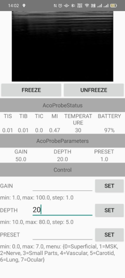

Aco Ultrasound Android SDK
===================

This SDK allows third party Android applications to communicate with Aco Handheld Ultrasound probe, fetch realtime images and send commands. 
It includes a reference of a sample Android App project for your potential POCUS application development.

# Prerequisites

- Aco ultrasound probe: https://acohealthcare.com/products/
- Valid license key per device

# Apply a license key

The SDK operates only when the Apache App is connected to a probe with a vaild license. 
To apply a license key, please contact Acohealthcare: https://acohealthcare.com/contact-us/. 
When invalid license is present, all APIs in the SDK will be unavailable. 
The license verification process is as follows:

1. Contact Acohealthcare and provide product information to request a license key for your device.
2. When using the SDK, the license key must be provided when connecting the device with API.

# Quick start

1. Download this sample project.

2. Open this project in Android Studio and run the example application on your Android device.

3. Power on your probe and open your mobile's Wi-Fi.

4. Discover your probe and connect with license key.

5. After connected, you can send commands and see the realtime parameter/images on the screen.

# API documents

Classes:
- [AcoUltrasound](./readme_api_documents/AcoUltrasound.md)
- [AcoProbe](./readme_api_documents/AcoProbe.md)

# Architecture

The Mobile SDK allow you to communicate with ultrasound probe with specific API.

